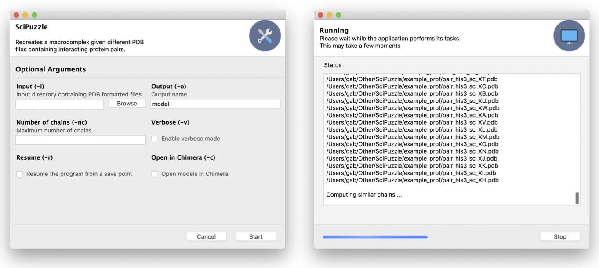
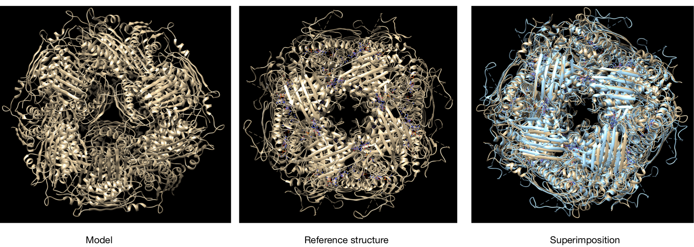
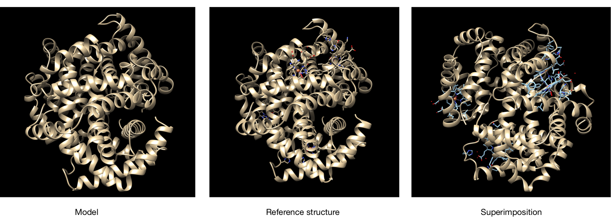
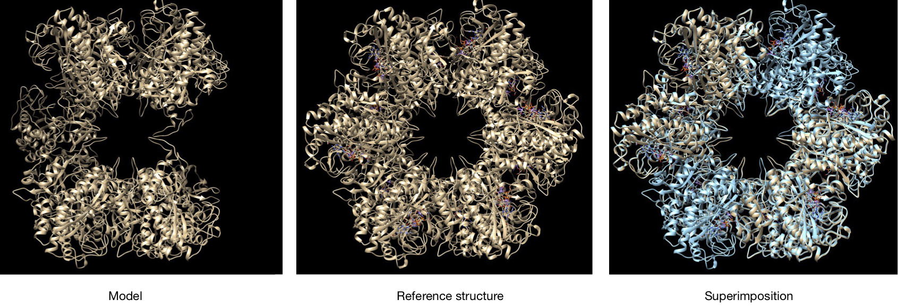

# SciPuzzle

## Table of Contents

<!-- TOC depthFrom:1 depthTo:6 withLinks:1 updateOnSave:1 orderedList:0 -->
* [Theoretical Background](#theoretical-background)
* [Installation and Description](#installation-and-description)
* [Examples](#examples)
  * [Example 1](#example-1)
  * [Example 2](#example-2)
* [Limitations](#Limitations)
* [Requirements](#Requirements)
* [Bibliography](#bibliography) 
  <!-- /TOC -->

## Theoretical Background

Protein macrocomplexes are a form of cuaternary structures, which consist in two or more polypeptide chains interacting with each other. These chains are known as subunits, and they can be identical or different.

Macrocomplexes are important in the definition of protein functionality and activity, and can be considered as functional modules inside the cell. They have special importance in structural proteins, which are constituted by repetitions of a one or few different subunits. In other cases, each subunit takes a different but related activity, which helps to simplify catalitic pathways by clustering related proteins into one funtional module.

The importance of macrocomplexes motivates the creation of this program, which tries to assemble the complete structure of a complex from a set of pairs of subunits. This program is called SciPuzzle, and its logic consists in two main steps:

*1. Storing information about the pairs*

In this step, the program analyses which chains in the input are pairs and checks which chains are similar.

 First, it goes through each file in the input folder and gets the two subunits it contains, assigning an ID to each of them. Information about which subunits were together in each file is kept. Then we get which subunits are similar by aligning their sequences: if they have a similarity of at least 95%, they are considered the same. At the end, the program removes the chain pair that are not useful to build the complex as they are not similars between any chain of another file.

Then, chains are stored in a dictionary, with their ID's as key, and a list containing which chains are pairs as values.

*2. Constructing the macrocomplex*

With the information from the previous step, SciPuzzle starts running a function recursively to build a macrocomplex by superimposition. In order to do this, it starts by taking a random interacting pair and setting it to be a complex. 

Then, it takes one of the subunits of the random pair chosen and looks for its similar chains. So, it will look for those files containing at least one similar chain to our "complex" to superimpose the chain. After that, the matrix given by Superimposer is applied to the other subunit, the one that is not similar, and  its coordinates are changed. Lastly, it checks that the superimposition has no clashes (the backbone of one structure does not protrude the backbone of the other). The criteria we use to define a clash between two structures is that at least one alpha carbon should be at less than 2 angstroms from any alpha carbon from another chain and a maximum of 30 clashes are allowed. If this is the case, the structure of this rotated chain is added to the complex and the function is called again with this new complex as one of the inputs.

If the number of chains that must have the macrocomplex is not entered by the user, the iterative function ends once SciPuzzle has used or tried to incorporate all the chains of the input files. On the other hand, if the number of chains desired is given, the iterative function ends when the macrocomplex that is being built has as many chains as the desired by the user. If the program uses all the chains in the input files and the number of chains is not accomplished, it returns the macrocomplex built with all the chains that the program could add. Please refere to the limitations and Example 3 section to learn more about these cases.


## Installation and Description

SciPuzzle can be downloaded from GitHub and installed with the `setup.py` file. This option also downloads the documentation.

```
git clone https://github.com/gabcg/scipuzzle.git
cd scipuzzle/scipuzzle
```

**Then, execute it as** `python3 main.py [options]`

The program needs a directory containing PDB files. Each file contains a pair of subunits from the same macrocomplex. Then, an output directory and the stoichiometry of the complex are specified. It has some extra options such as a graphical interface, a verbose mode or the ability to open the results in Chimera.

The command line options are:

* `-h, --help`: show this help message and exit
* `-i INPUT, --input INPUT`: input directory containing PDB formatted files.
* `-o OUTPUT, --output OUTPUT`: PDB formatted outputfile
* `-nc NUMBER_OF_CHAINS, --number_of_chains NUMBER_OF CHAINS`: number of chains desired
* ` -v, --verbose`: verbose mode
* `-r, --resume`: resume the program after a crash or when using a different stoichiometry
* `-c, --chimera`: open models in Chimera when execution finishes
* `-gui, --graphic_interface`: graphic user interface mode

Our graphic user interface (`scipuzzle -gui`) consists mainly in two windows. One of them asks for the different inputs and parameters. Then, when pressing the start button the window will change to another screen with a shell on it, which will show messages if the verbose option was checked. At the bottom right of the window, there are buttons to go back to the input screen and change them, restart SciPuzzle with the same options or exit.



> Note: the GUI does not render well in macOS Mojave if the system dark mode is being used, as the package is not addapted for it.


### Organization of the Package

SciPuzzle is composed by six modules:

* `__main__.py`: it contains the workflow of the program. Most of its actions depend on the other scripts.
* `arguments.py`: it contains the argument parser and two first parsing functions that get the files in the input folder and transform the stoichiometry string into a dictionary for further processing.
* `global_vars.py`: contains some variables used in more than one module.
* `interface.py`: as the arguments one, it gets the input from the user, but by launching a graphical user interface.
* `utils.py`: contains the functions used by the program.
* `messages.py`: contains verbose messages. 

## Examples

In this section, we show some of the structures that the program has been able to reconstruct.

The examples we executed can be found in the examples directory, which has the following organization:

* 1fpy, 6ezm and 1gzx contain the input to perform each of them (PDB files with pairs of proteins).
* real_structures contains the PDB files downloaded for comparison.
* results contains the models we obtained.

### Example 1

Our first example consists on running the program against subunit pairs obtained from imidazoleglycerol-phosphate dehydratase (PDB ID [6EZM](https://www.rcsb.org/structure/6ezm)). It is a key enzyme in the histidine synthesis pathway, so it is considered a good target for inhibition, as those could be used in herbicides. It is a homo 24-mer (stoichiometry A24). Following this, we compare the model obtained by SciPuzzle and the PDB file:



In the superimposition of the constructed and the model macrocomplexes we have obtained the following information:

RMSD between 177 pruned atom pairs is 0.639 angstroms; (across all 203 pairs: 6.312)

The obtention of the model was made by running:

```
python3 main.py -i ../examples/6ezm/ -v -o 6ezm_model
```

### Example 2

This protein is T state haemoglobin (PDB ID [1GZX](https://www.rcsb.org/structure/1gzx)), composed by four subunits with stoichiometry A2B2, organized in dimers. The complex has has two states -T and R-, in which the interaction between the subunits is different because the dimers move. We obtained the following model, that when superposed with the reference structure obtains a RMSD of 0:



The command used to execute this model is:

```
python3 main.py -i ../examples/1gzx -v -o 1gzx_model
```

### Example 3 

This example is trying to construct a Glutamine Synthetase protein (PDB ID [1FPY](https://www.rcsb.org/structure/1fpy)) from *Salmonella Typhimurium*. It is an enzyme that plays an essential role in the metabolism of nitrogen by catalyzing the consideration of glutamate and ammonia to form glutamine. The macrocomplex of this protein is formed with 12 chains and SciPuzzle tried to construct it by using only three input files with the same chain in each pair. Due to the limitations of our program, the model built was able to add only a total of 10 chains. One of the possible reasons of this phenomena could be that the lasts chains to be added had too clashes to fit and close the complex structure. Here, we show you three pictures where this can be observed.



The structure comparison analysis between the unfinished model and the real structure has the following results: RMSD between 468 pruned atom pairs is 0.000 angstroms; (across all 468 pairs: 0.000).

The command used to execute this model is:

```
python3 main.py -i ../examples/1fpy/ -v -o 1fpy_model -nc 10
```


## Limitations

- SciPuzzle does not handle the creation of a macrocomplexes that contain a pair of chains multiple times, unless the repeated pair is given as a repeated input file.
   We have been working on the development of a version of SciPuzzle where, if the number of chains parameter exceeds the number of chains found in files, the program after having added all the possible pairs given as input files will check for the possibility of adding them again and again till the number of chains actually corresponds to the number of chains found in the
    constructed complex (or there is no more possibility to add any of the available chains).
    Please refer to the example3 section to have more precise informations about this behaviour.
- Limited control over the parameters: in this version of SciPuzzle the control of the user over the parameters is limited on some basic inputs. Nonetheless, many functions have already been implemented in a way that would allow easily to set new inputs and parameters that could depend from the user inputs. Right now default values are used.
- Computationally intense: due to the big number of possibilities that need to be checked SciPuzzle can get very computationally intense. One possible improvement would be to create a more suitable and cheap way to interrupt possible recursion path, if we have a hint that those would probably end in a bad macrocomplex.
- DNA, RNA interactions: SciPuzzle currently does not handle the creation of macrocomplexes that include interactions with DNA and RNAs. That would be an useful feature that would be useful to be implemented.


## Requirements

The program needs Python installed in the computer, with the following third-party dependencies:

* Biopython for PDB file parsing, sequence alignment and structure superposition.
* Gooey, in order to build the graphical user interface.


## Bibliography

Visualization and comparison of the models and the structures is done using [UCSF Chimera](https://www.cgl.ucsf.edu/chimera/).

Backdround and knowledge about our example proteins was taken from the following sources:

* Pereira-Leal JB, Levy ED, Teichmann SA. The origins and evolution of functional modules: Lessons from protein complexes. Philos Trans R Soc B Biol Sci. 2006;361(1467):507-17.
* Rawson S, Bisson C, Hurdiss DL, Fazal A, McPhillie MJ, Sedelnikova SE, et al. Elucidating the structural basis for differing enzyme inhibitor potency by cryo-EM. Proc Natl Acad Sci. 20 de febrero de 2018;115(8):1795-800.
* Paoli M, Liddington R, Tame J, Wilkinson A, Dodson G. Crystal Structure of T State Haemoglobin with Oxygen Bound At All Four Haems. J Mol Biol. 8 de marzo de 1996;256(4):775-92. 


Authors: Luisa Santus, Aina Rill Hinarejos, Gabriel Carbonell Gamón


