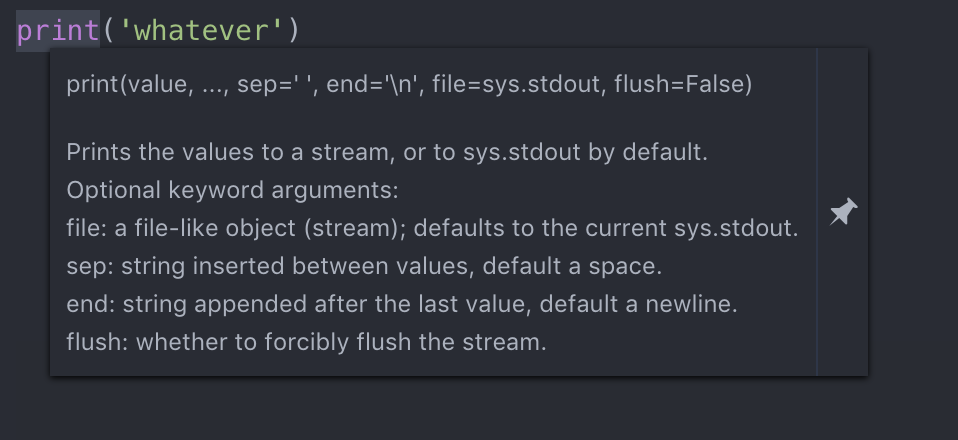
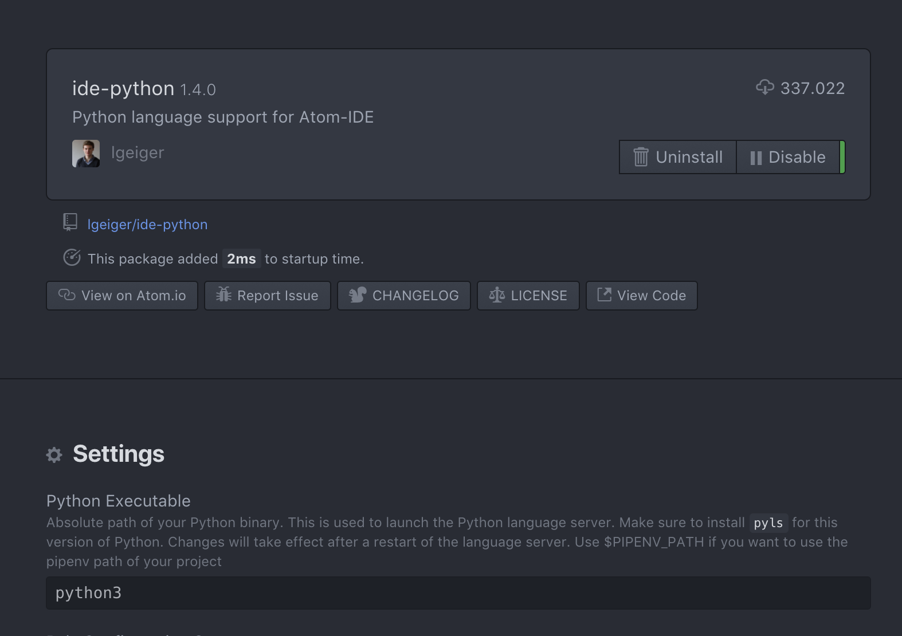

# PYT-SBI Project

## Some Tasks

1. We need to find a name that is better than this before cloning the repo.

## About the file structure of the package

We need to do an organized package. This means we need to divide functionality into different modules (files) and be confident with imports and dot syntax.

A proposal for the file structure would be:

* **`interface.py`**: it will contain the part of the program that has the interface.
* **`arguments.py`**: it will contain the argparser part. I guess we will import it to the core parts of the program, and we might do it as `import arguments as arg`, so we don't mix the namespaces, but still keep the prefix short.
* **`model.py`**: the core logic of the program goes here. This one **could be splitted in more files.** I'm not convinced by its name.
* **`__main__.py`**: it is the file that makes the package a package. It doesn't contain too much on it, just the basics for the program to run. The other files are the ones that have the important things.

All files should start with the following two lines (by convention):

```python
#!/usr/bin/env python3
# -*- coding: utf-8 -*-
```

> If you use Atom, this lines are autocompleted by typing `env3 + tab` and `enc + tab`.
> 

## Other files

The repository also contains other 📁, such as documents (which contains the images for Markdown files in assets, some links as weblock format (to be removed) and documents that have to do with the project.

There is also a folder that contains the example inputs that Javier gave us.


## About collaboration

It is important that everybody is able to understand the code of the others and what they have done. This can be achieved in two ways:

* Write proper documentation for the functions, classes and methods (which is a requirement for the Python mark.
* Comment the code, specially those lines, lambda functions and so that are not easy to understand.

Writing the documentation of functions also helps a lot when using Atom, as if you hover a function name, a box will appear containing its documentation:



Preferably, we should only merge to master when the feature is as bug-free as possible and when the code guidelines are good. Then, we should tell others about this merging and use the `update from master` option if possible.


## About the style of the code

Python has a style guide that is recommended to follow. This is easy to achieve with Atom with a debugguer. In order to install a Python debugger, you have to go to Atom's settings (click command and ,) and then go to the Packages section. Then search the 📦 `atom-ide-ui` and `ide-python` 🐍 and install them. They will require some actions before doing so, but they are easy to follow.

Then, you go to the `ide-python` settings and change *Python Executable* to python3:



Following are some examples of common mistakes. They don't need to be learnt by hard, as the debugger will tell us about them:

* Space before and after parentheses in functions:

```python
# Wrong
def a_function( arguments ):

# Correct
def a_function(arguments):
```

* Putting spaces around keyword/parameter equals:

```python
# Wrong: put spaces around keyword/parameter equals
fname(argument = 'arg1', argument2 = 'arg2')

# Correct
fname(argument='arg1', argument2='arg2')
```

> This is different from operators such as assigning a variable, (in)equality, greater or lower than, etc, which should have spaces around:
> 
> ```python
> # Wrong
> my_variable =variable
> 1== 1
> 1>0
> 
> # Correct
> my_variable = variable
> 1 == 1
> 1 > 0
> ```
> 

* Commas behave the same way as in written language: they **only** have a space **after** them:

```python
# Wrong

fname(argument,argument2)
fname(argument , argument2)
fname(argument ,argument2)

# Correct
fname(argument, argument2)
```

* Line lenght should be 79 characters long. Breaking a line can be tricky, but it is usually like:


```python
values = a_really_long_funtion_name_that_should_not_be_used(arg1, arg2, arg3,
                                                            arg4, arg5, arg6,
                                                            arg7, arg8, arg9)
```

* At last, empty lines: usually it should be only one (more are considered incorrect) but there are exceptions:

	* Two empty lines before and after a function/class definition. *I.e. all functions are separated by 2 lines*


```python
#Wrong
def function1(arg):
	pass

def function2(arg):
	pass
	
some_number = 1
	
#Correct
def function1(arg):
	pass


def function2(arg):
	pass
	
	
some_number = 1
```


```python
```